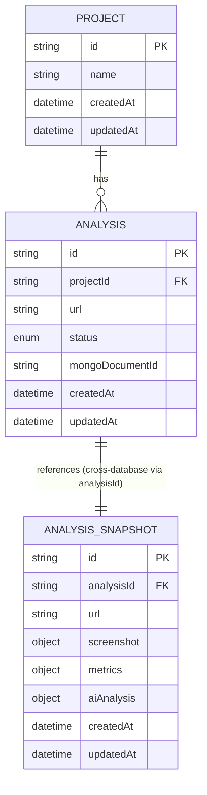

# Hybrid Database Architecture: PostgreSQL + MongoDB

This document outlines the hybrid database architecture implemented for the UIVerdict backend service. The design leverages both **PostgreSQL** and **MongoDB** intentionally based on data characteristics, querying requirements, and normalization rules.

---

## 1. Architecture Overview

UIVerdict uses a **Hybrid Database Strategy**:

- **PostgreSQL (via Prisma ORM)** handles structured, normalized relational metadata where data integrity, relationships (1:N Projects to Analyses), and transactional guarantees are required.
- **MongoDB (via Mongoose)** handles rich, flexible, document-based analysis snapshots (`AnalysisSnapshot`), combining Playwright screenshots, Lighthouse audit metrics, and Gemini AI qualitative critique.



---

## 2. PostgreSQL Design & Normalization

PostgreSQL stores execution state and workspace relationships using a normalized schema.

### Schema Normalization
- **`Project`**: Represents workspace or organizational units.
- **`Analysis`**: Stores execution status (`PENDING`, `PROCESSING`, `COMPLETED`, `FAILED`), target `url`, foreign key `projectId`, and `mongoDocumentId` cross-database pointer.

By extracting `Project` into its own table, project metadata is not duplicated across hundreds of individual analysis execution rows.

### PostgreSQL Indexes & Justifications
- `@@index([projectId])`: Accelerates queries listing analyses for a specific project.
- `@@index([url])`: Speeds up lookups of relational execution records for a URL.
- `@@index([status])`: Optimizes status filtering (e.g. finding pending or failed executions).
- `@@index([createdAt])`: Enables fast sorting and recency filtering.

---

## 3. MongoDB Design & Document Structure

MongoDB stores full execution snapshots as document snapshots.

### Document Schema (`AnalysisSnapshot`)
```json
{
  "_id": "66bc0f8e1234567890abcdef",
  "analysisId": "e5c4a1b0-7d8e-4f2a-9b1c-3d4e5f6a7b8c",
  "url": "https://www.apple.com/in/",
  "screenshot": {
    "url": "https://www.apple.com/in/",
    "filename": "20260812-www-apple-com.png",
    "path": "temp/screenshots/20260812-www-apple-com.png"
  },
  "metrics": {
    "performance": 85,
    "accessibility": 90,
    "bestPractices": 95,
    "seo": 90,
    "firstContentfulPaint": "1.2 s",
    "largestContentfulPaint": "2.5 s",
    "speedIndex": "1.8 s",
    "totalBlockingTime": "150 ms",
    "cumulativeLayoutShift": "0.05",
    "timeToInteractive": "2.8 s"
  },
  "aiAnalysis": {
    "overallVerdict": {
      "score": 89.2,
      "label": "GOOD"
    },
    "qualitativeCritique": ["Strong visual structure"],
    "strengths": ["Fast rendering"],
    "areasForRefinement": ["Optimize blocking JS"]
  },
  "createdAt": "2026-08-12T20:00:00.000Z",
  "updatedAt": "2026-08-12T20:00:00.000Z"
}
```

### MongoDB Indexes
- `analysisId` (Unique index): Fast 1-to-1 lookup connecting MongoDB document to PostgreSQL relational record.
- `url`: Fast filtering by target site.
- `createdAt`: Sorting by execution timestamp.
- Compound Index `{ url: 1, createdAt: -1 }`: Optimizes URL-specific historical queries sorted by recency.

---

## 4. Embedding vs. Referencing Rationale

### EMBEDDING
- `metrics`, `aiAnalysis`, and `screenshot` are **embedded** inside `AnalysisSnapshot`.
- **Reason**: These attributes are immutable properties of a single analysis run. They are always written together and retrieved together during analysis reporting. Embedding eliminates unnecessary database joins and ensures fast read performance.

### REFERENCING
- `analysisId` **references** the PostgreSQL `Analysis.id`.
- **Reason**: Prevents duplicating relational metadata (project hierarchy, execution status history) inside MongoDB while maintaining a clear cross-database link.

---

## 5. MongoDB Aggregation Pipeline

To compute analytical insights across historical runs, a real MongoDB aggregation pipeline is implemented:

```ts
db.analysissnapshots.aggregate([
  { $match: { url: "https://www.apple.com/in/" } },
  { $sort: { createdAt: -1 } },
  {
    $group: {
      _id: "$url",
      totalAnalyses: { $sum: 1 },
      avgPerformance: { $avg: "$metrics.performance" },
      avgAccessibility: { $avg: "$metrics.accessibility" },
      avgBestPractices: { $avg: "$metrics.bestPractices" },
      avgSeo: { $avg: "$metrics.seo" },
      avgOverallScore: { $avg: "$aiAnalysis.overallVerdict.score" },
      latestAnalysisAt: { $max: "$createdAt" }
    }
  },
  {
    $project: {
      _id: 0,
      url: "$_id",
      totalAnalyses: 1,
      avgPerformance: { $round: ["$avgPerformance", 1] },
      avgAccessibility: { $round: ["$avgAccessibility", 1] },
      avgBestPractices: { $round: ["$avgBestPractices", 1] },
      avgSeo: { $round: ["$avgSeo", 1] },
      avgOverallScore: { $round: ["$avgOverallScore", 1] },
      latestAnalysisAt: 1
    }
  }
])
```

---

## 6. PostgreSQL Transactions & Cross-Database Consistency

### Relational Transaction
Creation of `Project` and `Analysis` metadata is wrapped inside a Prisma `$transaction`:
```ts
await prisma.$transaction(async (tx) => {
  let project = await tx.project.findFirst({ where: { name: projectName } });
  if (!project) project = await tx.project.create({ data: { name: projectName } });
  
  const analysis = await tx.analysis.create({
    data: { projectId: project.id, url, status: "PROCESSING" }
  });
  return { project, analysis };
});
```

### Cross-Database Consistency Strategy
Because PostgreSQL and MongoDB are distinct database engines, they do not form an atomic two-phase commit distributed transaction. Instead, UIVerdict implements an explicit **compensating status pattern**:

1. PostgreSQL metadata created inside transaction (`status: PROCESSING`).
2. Analysis snapshot saved in MongoDB.
3. If MongoDB write succeeds: PostgreSQL `Analysis` status updated to `COMPLETED` with `mongoDocumentId`.
4. If MongoDB write fails: PostgreSQL `Analysis` status updated to `FAILED`, preventing incomplete state reporting.
