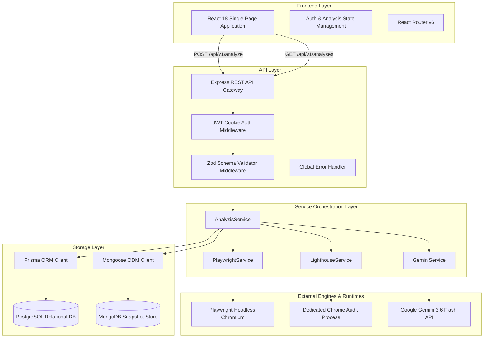

# UIVerdict — High-Level Design (HLD)

## Document Overview
This document specifies the High-Level Design (HLD) for **UIVerdict**, an automated UI/UX website quality evaluation platform. It details system objectives, high-level architecture, component responsibilities, end-to-end request workflows, data storage strategies, security models, and system resiliency.

---

## 1. Purpose

The objective of UIVerdict is to provide developers, UI/UX designers, and product owners with an automated, objective, and qualitative audit of any target website URL within ~60 seconds.

By combining empirical performance telemetry (Lighthouse) and visual rendering evidence (Playwright) with AI qualitative reasoning (Google Gemini), UIVerdict eliminates subjective bias and manual overhead in web design evaluations.

---

## 2. System Goals

- **Automated Multi-Stage Audit**: Execute screenshot capture, Core Web Vitals auditing, and qualitative design evaluation from a single URL submission.
- **Sub-60s Execution SLA**: Complete the entire end-to-end analysis pipeline in under 60 seconds.
- **Deterministic & Objective Scoring**: Anchor global UI/UX scores directly to empirical performance and accessibility data.
- **Structured AI Insights**: Produce clean, schema-validated JSON qualitative critiques, strengths, and recommendations without relying on unpredictable free-text parsing.
- **Hybrid Data Persistence**: Maintain relational data integrity for user histories and project metadata while storing rich unstructured evaluation snapshots.
- **Strict Data Isolation**: Guarantee that user evaluation logs and archive entries remain private and accessible only to authenticated owners.

---

## 3. System Overview

UIVerdict operates as a decoupled client-server web application comprising a modern Single-Page Application (SPA) frontend, an Express-based REST API gateway, an automated analysis orchestration engine, and a dual-database storage backend.

```
+-----------------------------------------------------------------------+
|                           CLIENT LAYER                                |
|                 React SPA (Vite + Tailwind CSS)                       |
+-----------------------------------------------------------------------+
                                   |
                               HTTP / REST
                                   |
+-----------------------------------------------------------------------+
|                         BACKEND API GATEWAY                           |
|            Node.js / Express (TypeScript) + Middleware                |
+-----------------------------------------------------------------------+
                                   |
         +-------------------------+-------------------------+
         |                         |                         |
+------------------+     +-------------------+     +--------------------+
| BROWSER ENGINE   |     | AUDIT ENGINE      |     | QUALITATIVE AI     |
| Playwright       |     | Lighthouse        |     | Gemini 3.6 Flash   |
| (Headless Chrome)|     | (Chrome Launcher) |     | (Google GenAI SDK) |
+------------------+     +-------------------+     +--------------------+
         |                         |                         |
         +-------------------------+-------------------------+
                                   |
                     +-------------+-------------+
                     |                           |
         +-----------------------+   +-----------------------+
         | RELATIONAL STORE      |   | SNAPSHOT STORE        |
         | PostgreSQL + Prisma   |   | MongoDB + Mongoose    |
         +-----------------------+   +-----------------------+
```

---

## 4. Architecture Diagram



---

## 5. Major Components

### 5.1 Frontend Application
- **Technology**: React 18, Vite, TypeScript, Tailwind CSS, Lucide Icons.
- **Role**: Provides the user interface for submitting URLs, visualizing real-time analysis progress, displaying forensic scorecards, and exploring historical evaluation archives.

### 5.2 Backend API Gateway
- **Technology**: Node.js, Express, TypeScript.
- **Role**: Manages HTTP routing (`/api/v1/*`), handles security headers (Helmet), manages CORS policies, parses cookies, and handles centralized exception formatting (`ApiError`).

### 5.3 Analysis Orchestration Engine (`AnalysisService`)
- **Role**: Coordinates the 7-phase analysis lifecycle. It creates PostgreSQL records, triggers screenshot capture, executes Lighthouse audits, calls Gemini AI, saves MongoDB document snapshots, and updates analysis statuses.

### 5.4 Browser Automation Engine (`PlaywrightService`)
- **Technology**: Playwright (Chromium).
- **Role**: Launches headless Chromium instances, configures desktop viewports (1280x800), navigates to target URLs, handles network timeouts, and captures full-page PNG screenshots.

### 5.5 Performance & Accessibility Audit Engine (`LighthouseService`)
- **Technology**: Lighthouse, `chrome-launcher`.
- **Role**: Spawns isolated Chrome processes on dynamic ports, executes automated audits for Performance, Accessibility, Best Practices, and SEO, and extracts Core Web Vitals (FCP, LCP, Speed Index, TBT, CLS, TTI).

### 5.6 Qualitative Reasoning Engine (`GeminiService`)
- **Technology**: `@google/genai` (`gemini-3.6-flash`).
- **Role**: Transmits audit evidence to Gemini AI with strict JSON Schemas, generating structured qualitative critiques, strengths, and areas for refinement.

### 5.7 Relational Storage Layer
- **Technology**: PostgreSQL, Prisma ORM.
- **Role**: Stores relational entity metadata (`User`, `Project`, `Analysis`), enforcing foreign key constraints, user ownership, and status tracking.

### 5.8 Snapshot Document Store
- **Technology**: MongoDB, Mongoose ODM.
- **Role**: Stores complete, schema-flexible audit documents (`AnalysisSnapshot`) containing full metrics, screenshot metadata, and AI qualitative outputs.

---

## 6. End-to-End Request Flow

```mermaid
sequenceDiagram
    autonumber
    actor User as User / Analyst
    participant Client as React SPA
    participant API as Express API Server
    participant Orchestrator as AnalysisService
    participant PG as PostgreSQL (Prisma)
    participant PW as Playwright
    participant LH as Lighthouse
    participant AI as Gemini AI
    participant Mongo as MongoDB (Mongoose)

    User->>Client: Input URL & Click ANALYZE
    Client->>API: POST /api/v1/analyze { url }
    API->>Orchestrator: analyzeUrl(url, userId)
    
    rect rgb(25, 25, 35)
        note right of Orchestrator: Phase 1: Database Initialization
        Orchestrator->>PG: createAnalysisTransaction() -> Status: PROCESSING
    end

    rect rgb(35, 25, 25)
        note right of Orchestrator: Phase 2: Screenshot Capture
        Orchestrator->>PW: captureScreenshot(url)
        PW-->>Orchestrator: Return ScreenshotResult (path, filename)
    end

    rect rgb(25, 35, 25)
        note right of Orchestrator: Phase 3: Performance Audit
        Orchestrator->>LH: runAudit(url)
        LH-->>Orchestrator: Return LighthouseMetrics
    end

    rect rgb(35, 35, 25)
        note right of Orchestrator: Phase 4: AI Critique Generation
        Orchestrator->>Orchestrator: calculateGlobalScore(metrics)
        Orchestrator->>AI: generateAnalysis(metrics, screenshot, globalScore)
        AI-->>Orchestrator: Return AiAnalysis JSON
    end

    rect rgb(25, 35, 35)
        note right of Orchestrator: Phase 5: Snapshot Persistence
        Orchestrator->>Mongo: saveSnapshot(analysisId, metrics, aiAnalysis, screenshot)
        Mongo-->>Orchestrator: Return mongoSnapshot._id
        Orchestrator->>PG: updateAnalysisStatus(analysisId, COMPLETED, mongoDocumentId)
    end

    Orchestrator-->>API: Return AnalysisResponse JSON Payload
    API-->>Client: HTTP 200 OK
    Client->>Client: Progress = 100% -> Navigate to /report/:id
    Client-->>User: Render Forensic Scorecard & Critique
```



---

## 7. Data Architecture (Dual-Database Pattern)

UIVerdict implements a hybrid storage architecture:

### 7.1 PostgreSQL (Relational Metadata Store)
- **Use Case**: Core relational entities requiring strict constraints, transactional safety, and index-accelerated query filters.
- **Key Entities**:
  - `User`: Authenticated user accounts (`id`, `email`, `passwordHash`).
  - `Project`: Organizational grouping for analyses (`id`, `userId`, `name`).
  - `Analysis`: Audit tracking records (`id`, `projectId`, `userId`, `url`, `status`, `mongoDocumentId`).

### 7.2 MongoDB (Document Snapshot Store)
- **Use Case**: High-volume, semi-structured evaluation payloads that contain complex nested objects (e.g., qualitative critique arrays, timing metrics, and screenshot metadata).
- **Key Document**:
  - `AnalysisSnapshot`: Unstructured document keyed by `analysisId`, preserving the exact JSON state produced by Lighthouse and Gemini AI.

---

## 8. Authentication & Authorization

- **Session Architecture**: HTTP-only JWT cookies issued upon `/api/v1/auth/login` or `/api/v1/auth/register`.
- **Password Security**: Passwords salted and hashed via `bcryptjs`.
- **Middleware Control**:
  - `authMiddleware`: Enforces valid JWT token on protected endpoints (`GET /api/v1/analyses`, `GET /api/v1/auth/me`).
  - `optionalAuthMiddleware`: Extracts user identity if present (`POST /api/v1/analyze`), allowing unauthenticated guest scans while attaching registered scans to `req.user.id`.
- **User Ownership Isolation**: Database queries for user archives explicitly enforce `where: { userId: req.user.id }`.

---

## 9. Error Handling & Resiliency

- **Centralized Exception Standard**: Custom `ApiError` class extending native JavaScript `Error` with HTTP status codes and operational flags.
- **Lighthouse Retry Policy**: Performs up to 2 attempts for Lighthouse Chrome process execution to withstand temporary port binding or FCP timeouts.
- **Gemini Exponential Backoff**: Detects transient errors (429, 503, rate limits) and retries up to 3 times with exponential backoff delays ($2s, 4s, 6s$).
- **Server Timeout Extensions**: Express server socket timeouts (`timeout`, `requestTimeout`, `headersTimeout`) are set to **300,000 ms (5 minutes)** to support long-running analysis workflows.
- **Transaction Rollback & Status Recovery**: If any step in the analysis pipeline throws an unhandled exception, the analysis status in PostgreSQL is updated to `FAILED`.

---

## 10. Scalability Considerations

### Current Architecture
The current version executes website analyses synchronously in-flight within Express request threads. While suitable for initial deployments, concurrency is naturally bounded by available host CPU and memory resources required for Chrome and Playwright processes.

### Future Improvements (Roadmap)
1. **Asynchronous Message Queue**: Transition from synchronous execution to an asynchronous job queue (e.g., Redis + BullMQ) with dedicated background worker processes.
2. **Horizontal Worker Scaling**: Decouple API web nodes from browser worker nodes, allowing Playwright and Lighthouse jobs to scale independently.
3. **Storage Offloading**: Migrate screenshot files from local disk (`temp/screenshots/`) to object storage (e.g., AWS S3 or Cloudflare R2).

---

## 11. Security Considerations

- **Secret Protection**: Secrets (`GEMINI_API_KEY`, `DATABASE_URL`, `MONGODB_URI`, `JWT_SECRET`) are managed strictly through environment variables and excluded from version control via `.gitignore`.
- **CORS Protection**: Restricted to explicitly whitelisted origin domains (`FRONTEND_URL`).
- **HTTP Header Hardening**: Enforced via `helmet()` to guard against clickjacking, MIME sniffing, and cross-site scripting (XSS).
- **Injection Defense**: PostgreSQL inputs parameterized by Prisma ORM; MongoDB inputs validated through Mongoose schemas; incoming HTTP bodies sanitized via Zod validation.

---

## 12. Deployment Considerations

- **Node.js Environment**: Requires Node.js `>= 20.0.0`.
- **Browser Dependencies**: Headless Chromium binaries (`npx playwright install chromium`) and System Chrome libraries must be present on the host OS environment.
- **Process Management**: Recommended execution via PM2 or systemd services in production.
