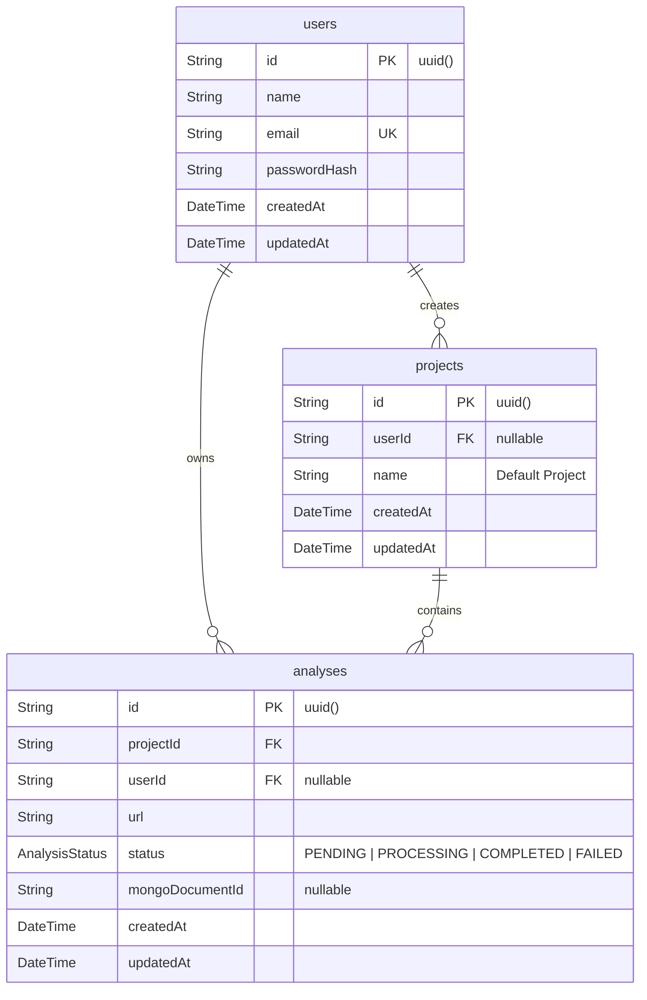

# UIVerdict — Low-Level Design (LLD)

## Document Overview
This document specifies the Low-Level Design (LLD) for **UIVerdict**. It details module structures, concrete TypeScript class/interface definitions, API controller logic, service implementations, database schemas, and data access methods.

---

## 1. Backend Module Structure

The backend application (`backend/src`) is organized into distinct domain layers:

```
backend/src/
├── config/
│   ├── env.ts                   # Environment variable parsing & validation
│   ├── mongodb.ts               # Mongoose connection manager
│   └── postgres.ts              # Prisma client initialization & connection manager
├── controllers/
│   ├── analysis.controller.ts   # Handler for POST /api/v1/analyze
│   ├── archive.controller.ts    # Handler for GET /api/v1/analyses
│   └── auth.controller.ts       # Handlers for login, register, logout, me
├── errors/
│   └── ApiError.ts              # Operational error class extending Error
├── middleware/
│   ├── auth.middleware.ts       # JWT verification (auth & optionalAuth)
│   ├── errorHandler.ts          # Express global error handler
│   ├── notFound.ts              # 404 handler
│   └── validate.ts              # Zod request body validation middleware
├── models/
│   └── mongo/
│       └── snapshot.model.ts    # Mongoose schema for AnalysisSnapshot
├── repositories/
│   ├── mongo/
│   │   └── mongo.repository.ts  # MongoRepository abstraction
│   └── postgres/
│       └── postgres.repository.ts # PostgresRepository abstraction
├── routes/
│   ├── index.ts                 # Master router mounting /health and /api/v1
│   ├── health.routes.ts         # GET / and GET /health
│   └── v1/
│       ├── analysis.routes.ts   # Router for /api/v1/analyze
│       ├── archive.routes.ts    # Router for /api/v1/analyses
│       └── auth.routes.ts       # Router for /api/v1/auth/*
├── services/
│   ├── analysis.service.ts      # Main pipeline orchestration service
│   ├── auth.service.ts          # Password hashing, JWT signing, user auth
│   ├── gemini.service.ts        # Google GenAI integration & retry handler
│   ├── lighthouse.service.ts    # Lighthouse audit launcher & metric extractor
│   └── playwright.service.ts    # Playwright browser screenshot capturer
├── validators/
│   ├── aiAnalysis.validator.ts  # Zod schema for AI analysis payload
│   ├── analysis.validator.ts    # Zod schema for URL analysis request
│   └── auth.validator.ts        # Zod schemas for login and register
├── app.ts                       # Express application configuration
└── server.ts                    # HTTP server listener & socket timeout setup
```

---

## 2. Frontend Module Structure

The frontend application (`frontend/src`) follows a modular component layout:

```
frontend/src/
├── components/
│   ├── dashboard/               # MetricsOverview, ProtocolList
│   ├── forms/                   # LoginForm, RegisterForm
│   ├── hero/                    # UrlSearchForm
│   ├── history/                 # DataLogTable, FilterSidebar, ProfileCard
│   ├── navigation/              # Navbar, Footer
│   └── report/                  # ReportHeader, ScorePanel, QualitativeCritique, StrengthsRefinements, StatisticsChart
├── contexts/
│   └── AuthContext.tsx          # Authentication provider and session state
├── layouts/
│   └── MainLayout.tsx           # Application layout wrapper with Navbar & Footer
├── pages/
│   ├── Analysis/AnalysisPage.tsx# Staged progress loading screen & scan trigger
│   ├── Auth/LoginPage.tsx       # Analyst login view
│   ├── Auth/RegisterPage.tsx    # Analyst registration view
│   ├── Dashboard/DashboardPage.tsx # Analysis metrics dashboard
│   ├── History/HistoryPage.tsx  # Historical evaluation archive page
│   ├── Home/HomePage.tsx        # Hero landing page
│   └── Report/ReportPage.tsx    # Forensic scorecard view
├── routes/
│   └── AppRoutes.tsx            # React Router route declarations
├── services/
│   ├── analysis.service.ts      # API call to POST /api/v1/analyze
│   ├── auth.service.ts          # API calls to /api/v1/auth/*
│   ├── history.service.ts       # API call to GET /api/v1/analyses
│   └── report.service.ts        # In-memory and sessionStorage report cache
├── types/
│   ├── analysis.ts              # Analysis dashboard TypeScript types
│   ├── history.ts               # Archive table TypeScript types
│   └── report.ts                # Scorecard report TypeScript types
├── App.tsx                      # App entry component
└── main.tsx                     # React DOM root render
```

---

## 3. API Layer

### 3.1 Controller Routing Table

```
Route Base: /api/v1
├── /auth
│   ├── POST /register      -> authController.register
│   ├── POST /login         -> authController.login
│   ├── POST /logout        -> authMiddleware -> authController.logout
│   └── GET  /me            -> authMiddleware -> authController.getMe
├── /analyze                -> optionalAuthMiddleware -> validate(analyzeSchema) -> analysisController.analyze
└── /analyses               -> authMiddleware -> archiveController.getArchiveAnalyses
```

### 3.2 Error Handler Middleware (`errorHandler.ts`)

```typescript
export const errorHandler = (
  err: any,
  req: Request,
  res: Response,
  next: NextFunction
): void => {
  const statusCode = err.statusCode || 500;
  const message = err.message || 'Internal Server Error';

  res.status(statusCode).json({
    status: 'error',
    statusCode,
    message,
    ...(process.env.NODE_ENV === 'development' && { stack: err.stack }),
  });
};
```

---

## 4. Authentication Implementation

### 4.1 Service Layer (`auth.service.ts`)

- **Password Hashing**: Encrypted via `bcryptjs.hash(password, 10)`.
- **Password Verification**: Validated via `bcryptjs.compare(password, user.passwordHash)`.
- **JWT Generation**: `jsonwebtoken.sign({ id: user.id, email: user.email }, config.jwtSecret, { expiresIn: '7d' })`.

### 4.2 Cookie Configuration

```typescript
res.cookie('token', token, {
  httpOnly: true,
  secure: process.env.NODE_ENV === 'production',
  sameSite: 'lax',
  maxAge: 7 * 24 * 60 * 60 * 1000, // 7 days
});
```

---

## 5. Analysis Service Orchestration (`AnalysisService`)

`AnalysisService.analyzeUrl(url: string, userId?: string)` executes the 7-phase orchestration sequence:

```typescript
public async analyzeUrl(url: string, userId?: string): Promise<AnalysisResponse> {
  let analysisId: string | null = null;

  try {
    // Phase 1: PostgreSQL Record Creation (Status: PROCESSING)
    const { analysis } = await postgresRepository.createAnalysisTransaction(url, 'Default Project', userId);
    analysisId = analysis.id;

    // Phase 2: Full-Page Screenshot Capture
    const screenshotData: ScreenshotResult = await playwrightService.captureScreenshot(url);

    // Phase 3: Lighthouse Performance & Accessibility Audit
    const metrics: LighthouseMetrics = await lighthouseService.runAudit(url);

    // Phase 4: Deterministic Global Score Calculation
    const globalScore = this.calculateGlobalScore(metrics);

    // Phase 5: Qualitative Gemini AI Evaluation
    const aiAnalysis: AiAnalysis = await geminiService.generateAnalysis({
      url,
      metrics,
      screenshot: screenshotData,
      globalScore,
    });

    // Phase 6: MongoDB Document Snapshot Storage
    const mongoSnapshot = await mongoRepository.saveSnapshot({
      analysisId: analysis.id,
      url,
      screenshot: screenshotData,
      metrics,
      aiAnalysis,
    });

    // Phase 7: PostgreSQL Status Update to COMPLETED
    await postgresRepository.updateAnalysisStatus(
      analysis.id,
      AnalysisStatus.COMPLETED,
      mongoSnapshot._id.toString()
    );

    return {
      status: 'success',
      message: 'Analysis completed successfully',
      data: { url, screenshot: { filename: screenshotData.filename, path: screenshotData.path }, metrics, aiAnalysis },
    };
  } catch (error: any) {
    if (analysisId) {
      await postgresRepository.updateAnalysisStatus(analysisId, AnalysisStatus.FAILED);
    }
    throw error;
  }
}
```

### 5.1 Global Score Calculation Formula
$$\text{GlobalScore} = \text{Math.round}\left((0.30 \times \text{Perf} + 0.25 \times \text{A11y} + 0.20 \times \text{BestPractices} + 0.25 \times \text{SEO}) \times 10\right) / 10$$

---

## 6. Playwright Implementation (`PlaywrightService`)

- **Browser Launch**: Headless Chromium instance via `chromium.launch({ headless: true })`.
- **Context Config**: Viewport fixed at `1280x800` desktop resolution; `ignoreHTTPSErrors: true`.
- **Navigation Strategy**: Navigates using `page.goto(targetUrl, { waitUntil: 'domcontentloaded', timeout: 30000 })`.
- **Visual Settling**: Issues a 2000ms settling wait (`page.waitForTimeout(2000)`) before screenshot capture.
- **Output File Structure**: Screenshots saved to `temp/screenshots/${date}-${time}-${hostname}-${random}.png`.

---

## 7. Lighthouse Implementation (`LighthouseService`)

- **Chrome Isolation**: Launches dedicated Chrome instance via `chromeLauncher.launch()` with flags:
  - `--headless=new`, `--no-sandbox`, `--disable-gpu`, `--disable-dev-shm-usage`.
- **Categories Audited**: `['performance', 'accessibility', 'best-practices', 'seo']`.
- **Metrics Extracted**:
  - Scores: `performance`, `accessibility`, `bestPractices`, `seo` (0-100 scale).
  - Timing Audit Strings: `firstContentfulPaint`, `largestContentfulPaint`, `speedIndex`, `totalBlockingTime`, `cumulativeLayoutShift`, `timeToInteractive`.
- **Retry Logic**: Encapsulated in `runAudit()` — executes up to 2 attempts with a 2000ms delay between retries.

---

## 8. Gemini Implementation (`GeminiService`)

- **SDK**: Initialized via `new GoogleGenAI({ apiKey: config.geminiApiKey })`.
- **Model**: Enforces `gemini-3.6-flash`.
- **Structured JSON Schema**:

```typescript
const responseSchema = {
  type: Type.OBJECT,
  properties: {
    overallVerdict: {
      type: Type.OBJECT,
      properties: {
        score: { type: Type.NUMBER },
        label: { type: Type.STRING, enum: ['EXCELLENT', 'GOOD', 'SATISFACTORY', 'NEEDS IMPROVEMENT', 'POOR'] },
      },
      required: ['score', 'label'],
    },
    qualitativeCritique: { type: Type.ARRAY, items: { type: Type.STRING } },
    strengths: { type: Type.ARRAY, items: { type: Type.STRING } },
    areasForRefinement: { type: Type.ARRAY, items: { type: Type.STRING } },
  },
  required: ['overallVerdict', 'qualitativeCritique', 'strengths', 'areasForRefinement'],
};
```

- **Transient Error Retry**: Catches HTTP 429, 500, 503, and quota errors, executing up to 3 attempts with exponential backoff (`attempt * 2000ms`).

---

## 9. PostgreSQL / Prisma Data Design

### 9.1 Entity Relationship Diagram



---

## 10. MongoDB / Mongoose Data Design

### 10.1 `AnalysisSnapshot` Schema

```typescript
const AnalysisSnapshotSchema = new Schema<IAnalysisSnapshot>(
  {
    analysisId: { type: String, required: true, unique: true, index: true },
    url: { type: String, required: true, index: true },
    screenshot: {
      url: { type: String, required: true },
      filename: { type: String, required: true },
      path: { type: String, required: true },
    },
    metrics: {
      performance: { type: Number, required: true },
      accessibility: { type: Number, required: true },
      bestPractices: { type: Number, required: true },
      seo: { type: Number, required: true },
      firstContentfulPaint: { type: String, required: true },
      largestContentfulPaint: { type: String, required: true },
      speedIndex: { type: String, required: true },
      totalBlockingTime: { type: String, required: true },
      cumulativeLayoutShift: { type: String, required: true },
      timeToInteractive: { type: String, required: true },
    },
    aiAnalysis: {
      overallVerdict: {
        score: { type: Number, required: true },
        label: { type: String, required: true },
      },
      qualitativeCritique: [{ type: String, required: true }],
      strengths: [{ type: String, required: true }],
      areasForRefinement: [{ type: String, required: true }],
    },
  },
  { timestamps: true }
);
```

---

## 11. Repository Abstraction Layer

- **`PostgresRepository`**:
  - `createAnalysisTransaction(url, projectName, userId)`: Executes Prisma interactive transaction to find/create default project and create initial `Analysis` record with status `PROCESSING`.
  - `updateAnalysisStatus(id, status, mongoDocumentId)`: Updates analysis status to `COMPLETED` or `FAILED`.
- **`MongoRepository`**:
  - `saveSnapshot(snapshotData)`: Inserts or updates `AnalysisSnapshot` document by `analysisId`.
  - `getSnapshotByAnalysisId(analysisId)`: Retrieves snapshot document by `analysisId`.

---

## 12. Frontend State Machine & Staged Loading

In `AnalysisPage.tsx`, loading progress is driven by a staged visual state machine while the HTTP request is in-flight:

```
[Start Scan] -> Progress = 5% (Stage 1: Validating Target URL)
     |
  Interval -> Progress -> 20% (Stage 2: Capturing High-Res Screenshot)
     |
  Interval -> Progress -> 50% (Stage 3: Auditing Performance & Accessibility)
     |
  Interval -> Progress -> 75% (Stage 4: Qualitative UI/UX Evaluation)
     |
  Interval -> Progress -> 95% (Stage 5: Persisting Snapshots & Finalizing)
     |
[HTTP 200 Received] -> Progress = 100% (All Stages COMPLETE) -> Navigate to /report/:id
```

---

## 13. Error Handling Architecture

- **HTTP Status Codes**:
  - `400 Bad Request`: Invalid URL structure or duplicate email registration.
  - `401 Unauthorized`: Missing or invalid session token.
  - `429 Too Many Requests`: Rate limit exceeded on AI services.
  - `502 Bad Gateway`: Target website DNS or connection failures.
  - `504 Gateway Timeout`: Target website page load timeout (>30s).
- **Frontend Display**: Form error banners trap exceptions and prompt immediate re-entry without page crashes.

---

## 14. Testing Architecture

### 14.1 Backend Test Runner (`npm test`)

Executes unit and integration test scripts sequentially using `ts-node`:

1. **`auth.service.test.ts`**:
   - Tests user registration, duplicate email rejection, bcrypt hashing, login authentication, session retrieval (`/auth/me`), and database-level user ownership isolation.
2. **`gemini.service.test.ts`**:
   - Mocks inputs and validates Gemini API structured output generation against Zod schemas.
3. **`persistence.service.test.ts`**:
   - Validates Prisma PostgreSQL transactions and Mongoose MongoDB document creation/retrieval.
4. **`multi_site_verify.test.ts`**:
   - Integration script testing live URLs through the full pipeline.
